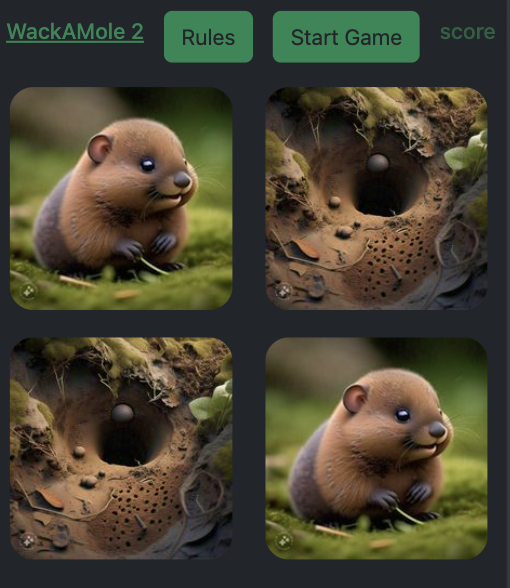

# WackAMole 2.0
## Description
This web browser based game offers a simple Whack-A-Mole user experience. Gather points along the way and try to get the highest score! Birthday moles give more points but the evil mole will take them away.
## Usage
This fun game is intended for all ages! Just click the start button!
## Technical Features
### Version 1:
Easy to use UI/UX built with the Bootstrap CSS Framework. The game itself uses a number of JS functions to set a game timer, populate a mole at a set increment and count the points on click. The points are stored in local storage and returned on the page. 
### Version 2:
Updated UI to be responsive for an optimized mobile browser experience. Added a randomizer to the moles. Added 3 more moles for a more engaging experience.  
[Link to the Game.](https://jzaroli.github.io/Wackamole-2.0_JS-Game/)

Screenshot:  

## Credits
Version 1.0: HTML and CSS by Zachary de Hart. HTML, CSS and JS by Johann Zaroli.  
Version 2.0: by Johann Zaroli.
## How to Contribute
Please reach with any feature enhancement requests to make the game more fun!  
Future enhancement ideas include:  
1 - A visual timer.
2 - A backend that stores and returns the all-time leader scoreboard.  
3 - Different difficulty levels with seperate point rewards.  
4 - A genAI enhanced image generator that changes the moles to other animals.
